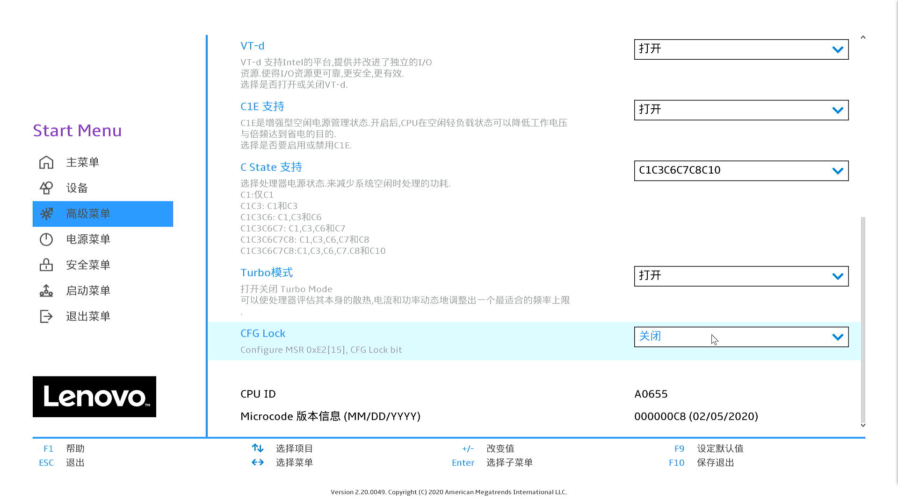
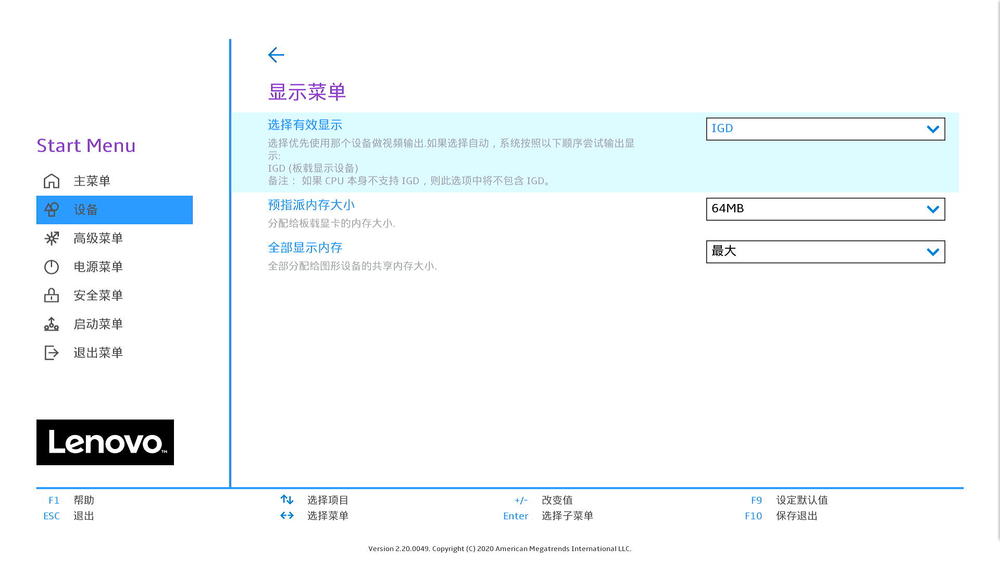
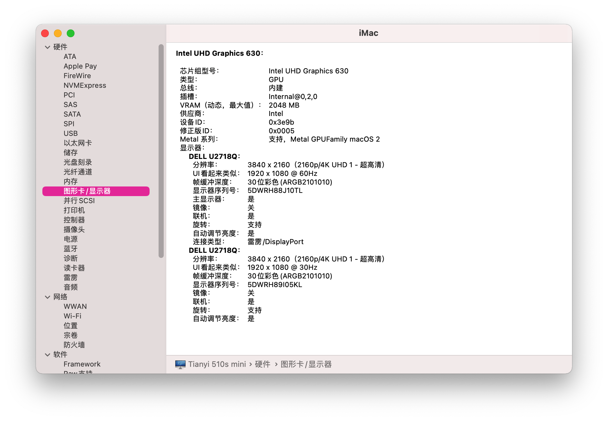
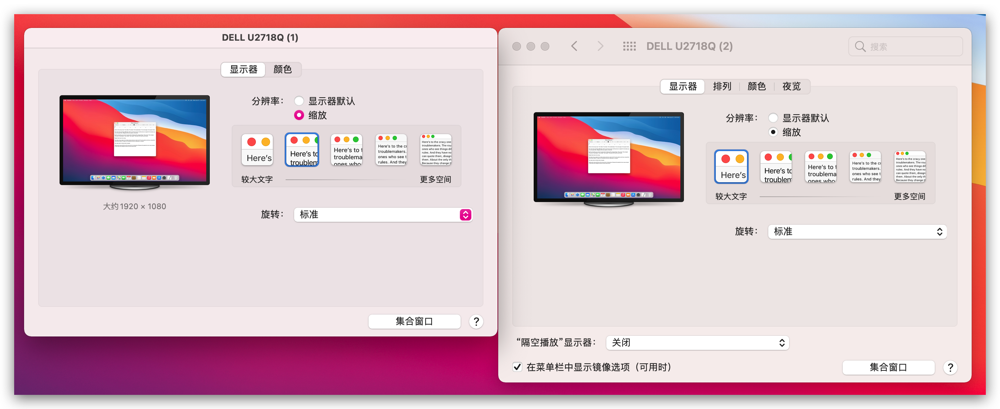
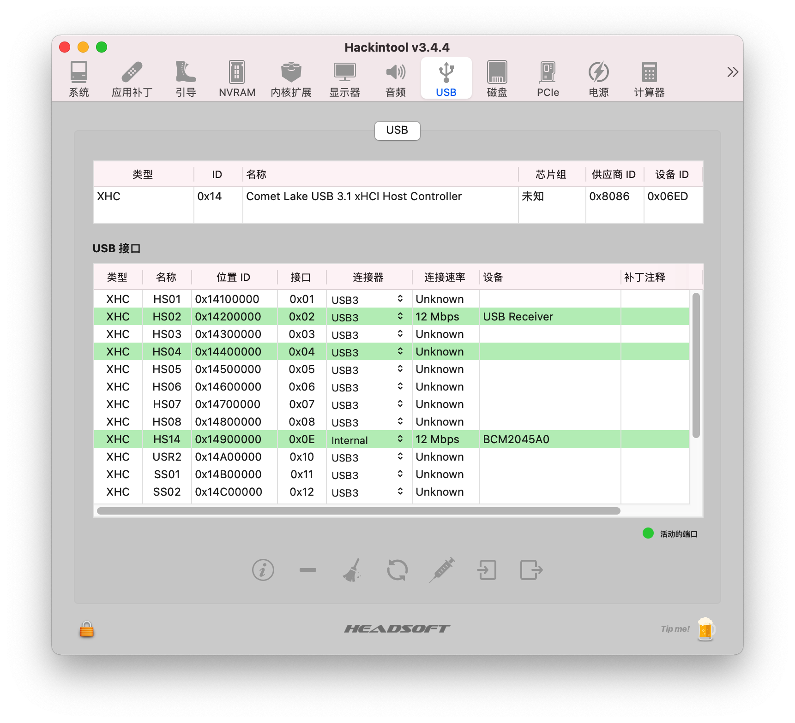
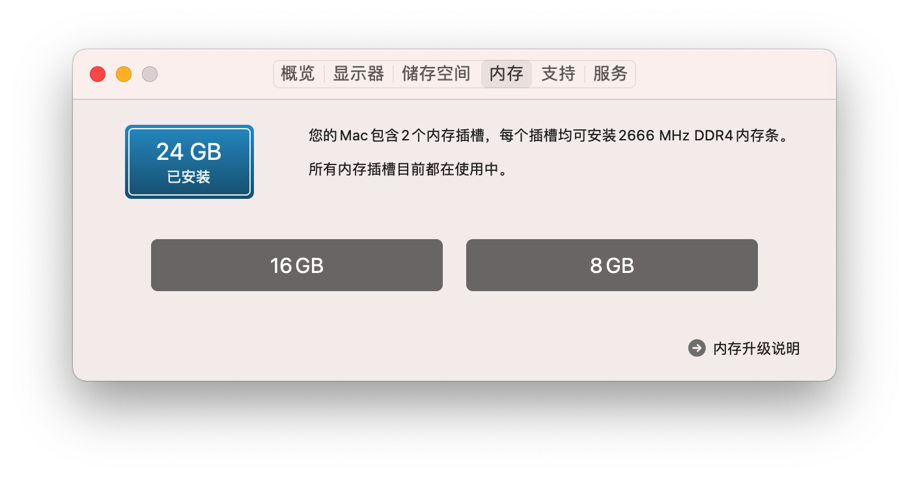

# Lenovo 天逸 510S Mini Hackintosh

## 电脑配置

|   规格   |                           详细信息                           |
| :------: | :----------------------------------------------------------: |
| 电脑型号 |                  联想Lenovo 天逸 510S Mini                   |
| 操作系统 |                        macOS Big Sur                         |
|  处理器  |                    英特尔 酷睿 i5 - 10400                    |
|   内存   |                             16GB                             |
|  硬盘1   |               SKhynix 256GB，已更换为WD SN750                |
|  硬盘2   |                       ST2000LM007 2TB                        |
|   显卡   |                  Intel HD Graphics CFL CRB                   |
|  显示器  |                              无                              |
|   声卡   |                        Realtek ALC235                        |
|   网卡   | Intel AX201，已更换为 [DW1820A](https://blog.daliansky.net/DW1820A_BCM94350ZAE-driver-inserts-the-correct-posture.html) |

## 更新日志

- 12-25-2020
  - 修复`HDMI`睡眠唤醒后的黑屏问题，感谢群友@恩-和气生财的反馈
  - Release `v1.3.0`
- 12-24-2020
  - OpenCore `v0.6.4`
  - Release `v1.2.0`
- 11-18-2020
  - OpenCore `v0.6.3`
  - 精简无用的驱动
- 10-26-2020
  - 修复`HDMI`紫屏问题，完美支持`DP+HDMI`双屏显示
- 10-13-2020
  - OpenCore `v0.6.2`
  - 支持`Big Sur` / `Catalina`安装使用
  - 支持`DP` + `HDMI`双显
  - 声卡驱动完美，包括显示器音频输出功能正常
  - 网卡驱动默认为：`DW1820A`，如果使用`INTEL`无线网卡请在配置文件中勾选三个驱动

### 设置`BIOS`

- 安全菜单：
  
  - 安全启动 -> `关闭`  (*Disable Secure Boot*)
  
- 高级菜单：
  
  - CPU菜单：`CFG Lock` -> `关闭` (*Disabling CFG Lock*)【相关BIOS请进群获取】
  
  
  
- 设备：
  - 显示设备
    - 预指派内存大小：`64MB` (*DVMT* pre-allocated memory)
  
  
  
  - ATA设备菜单：
    - `配置SATA为` -> `AHCI`
  
- 其它参数默认即可

## 备注：

关于`HDMI`显示输出：

如果你的显示器没有`DP`接口，那么可以考虑购买一条`DP`转`HDMI`的线连接上就好了，也省得看下文了。

- 小兵在测试的时候发现质量差的，版本低的`HDMI`线材是无法正确识别并点亮`HDMI`的显示输出。这个问题对小兵造成了很大的困扰，折腾了好些天。在跟因为黑苹果而结缘的法师的提醒下，他无偿赞助了我一根支持`HDMI` `v2.1` 支持到`8K@60Hz` / `4K@120Hz`的线材，到手后直接点亮`HDMI`显示器，估计支持`v2.0` `4K@60Hz`的线材也能正常使用，低于`v2.0`版本的可能就需要注入`EDID`值才能显示输出

  线材购买链接：https://item.jd.com/100008665276.html

- 配置文件中，在`DeviceProperties` - `PciRoot(0x0)/Pci(0x2,0x0)`里，我添加了三行以`#`开头的注释信息，其中第一行为备注，内容为：

  ```xml
  #0备注：如果想单独使用HDMI输出显示，请启用#AAPL0x这两行关于显示器的注入信息，也可以替换成自己的显示器的EDID值
  ```

  后面的两行`#AAPL0x`开头的为两台显示器的注入信息，它可以保证在普通线材连接`HDMI`接口的情况下能正确点亮显示器完成安装，使用的时候需要将`#AAPL0x`中的`#`移除掉以使其数值生效

- `EDID`值可以注入你自己的显示器，这样可以保证显示输出正常工作，至于如何提取`EDID`值，请移步博客或者通过谷歌搜索寻找答案

## 截屏












## QQ交流群：

942112153 [天逸510s Mini黑苹果交流群](https://qm.qq.com/cgi-bin/qm/qr?k=N5cjw5ksrnmk-RMQ4fPCOo5D_Dxiu47B&jump_from=webapi) 1000人群 非专用机型请勿加入

## EFI下载

https://github.com/daliansky/Lenovo-TianYi-510S-Mini-Hackintosh/releases/

